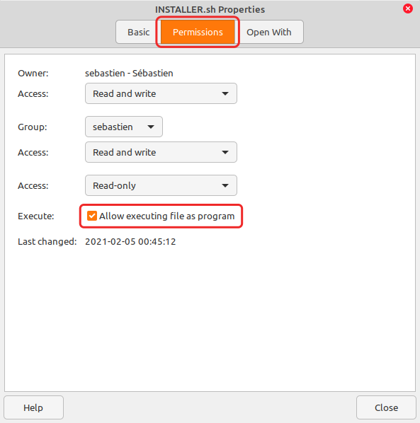

# labo-logo: A Plymouth theme for the Labo Metrology machines
This is a new version for your animated boot screen.  
It's designed for FHD 1080p monitors, but works pretty well also on smaller and larger displays.



### How to install
1. [Download ZIP here](https://github.com/Parmacontrols/labo-plymouth-theme/archive/main.zip) (OR click on top-right green button "Code" and then click on "Download ZIP")
2. Extract this entire zip
3. Right-click on INSTALLER.sh > Select Properties > Permissions tab > Execute: Allow executing file as program. (See screenshot) OR ELSE type `chmod +x labo-plymouth-theme/INSTALLER.sh` in the Terminal
4. Double-click on INSTALLER to run in Terminal
5. Restart and check the results!

### How to revert to the original mint-logo
1. Set permissions for REVERT.sh to "Allow executing file as program" just like you did for INSTALLER.sh, as described above
2. Double-click on REVERT to run in Terminal
...Restart and check the results!

### How to check things (optional)
You can check things with this command:
`update-alternatives --display default.plymouth`

You can preview your default plymouth using the plymouth-preview script. You must run this script as root. To do so, you need to open your Terminal in this downloaded /labo-plymouth-theme directory and run this script this way:

```
cd labo-plymouth-theme
sudo ./plymouth-preview.sh
```

This will preview the splash screen for 10 seconds. You can change this default 10 seconds by adding " XX #seconds" at the end of the command. Example:

```sudo ./plymouth-preview.sh 20```

for a 20 seconds preview
